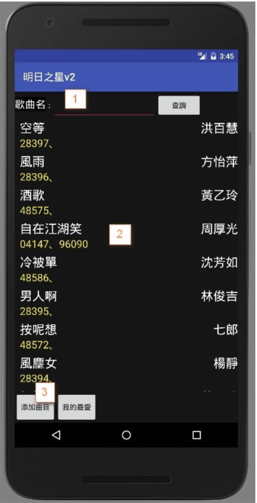

## 明日之星 Superstar

### 問題情境:
傳統練歌坊、卡拉 OK 使用厚重的點歌本查曲目，不但耗時且無法多人使用

### 解決方案:
此App 提供離線搜尋功能，收錄了伴唱機廠商如: `金嗓、弘音`等曲目、歌曲代號，提供給練歌坊、卡拉 OK 店家使用，增進查歌效率，並在廠商追加新歌時，可透過 App 內建功能將曲目擴，未來可考慮使用網路連線的方式搜尋曲目

### App簡介:

Google Play Market [download](https://play.google.com/store/apps/details?id=com.superstar.app&hl=zh_TW)

這是一款不需依賴網路的 App,曲目資料由檔案的方式寫入 SQLite, 透過操作介面,可簡易查到需要的曲目。

### 功能介紹:
- 支援**歌曲名**、**演唱者**兩種查詢方式
- 長按曲目,會跳出刪除選項
- 新增曲目填寫資料

